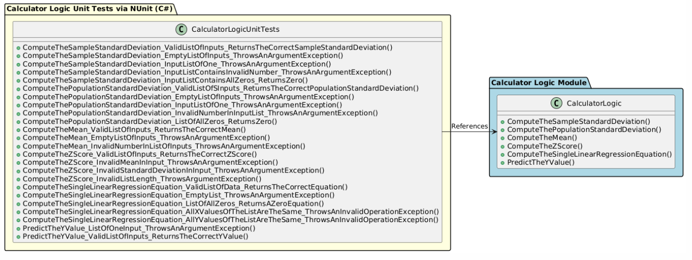

# KSU SWE 3643 Software Testing and Quality Assurance Semester Project: Web-Based Calculator Unit Tests

This repository contains the source code for the Calculator Logic and the CalculatorLogic Unit Tests. It also contains this README that lists the project team members, explains the system architecture with a professional diagram, explains the enviornment that this project was built in, along with step-by-step instructions on how to execute the project code on your own machine. On top of this, this README also reviews the 100% unit test coverage that my tests cover, and provides a quality YouTube video that further explains this repository and how to execute the unit tests on your machine.

## Table of Contents

- [Team Members](#team-members)
- [Architecture](#architecture)
- [Environment](#environment)
- [Executing Unit Tests](#executing-unit-tests)
- [Reviewing Unit Test Coverage](#reviewing-unit-test-coverage)
- [Final Video Presentation](#final-video-presentation)

## Team Members
This project was completed by one person:
- Matt Crowley (Fun Fact: Loves animals!)

## Architecture
The system is designed in a way where the two modules are loosely coupled. There are two different projects in this Rider solution. There is a CalculatorLogic project and a CalculatorLogicUnitTests project. The unit test class does not perform any mathematical operations whatsoever. It simply references the calculator logic module and performs tests on it. The tests achieve 100% coverage whilst testing for various different failing states and succeeding states. This diagram was created in PlantUML, and I will provide the diagram along with the code below.

**System Architecture Diagram**


**PlantUML Code**
```
@startuml
allowmixing

package "Calculator Logic Module" #lightblue
{
    class CalculatorLogic {
        + ComputeTheSampleStandardDeviation()
        + ComputeThePopulationStandardDeviation()
        + ComputeTheMean()
        + ComputeTheZScore()
        + ComputeTheSingleLinearRegressionEquation()
        + PredictTheYValue()
    }

}

package "Calculator Logic Unit Tests via NUnit (C#)" #lightyellow
{
  class CalculatorLogicUnitTests {
    + ComputeTheSampleStandardDeviation_ValidListOfInputs_ReturnsTheCorrectSampleStandardDeviation()
    + ComputeTheSampleStandardDeviation_EmptyListOfInputs_ThrowsAnArgumentException()
    + ComputeTheSampleStandardDeviation_InputListOfOne_ThrowsAnArgumentException()
    + ComputeTheSampleStandardDeviation_InputListContainsInvalidNumber_ThrowsAnArgumentException()
    + ComputeTheSampleStandardDeviation_InputListContainsAllZeros_ReturnsZero()
    + ComputeThePopulationStandardDeviation_ValidListOfSInputs_ReturnsTheCorrectPopulationStandardDeviation()
    + ComputeThePopulationStandardDeviation_EmptyListOfInputs_ThrowsAnArgumentException()
    + ComputeThePopulationStandardDeviation_InputListOfOne_ThrowsAnArgumentException()
    + ComputeThePopulationStandardDeviation_InvalidNumberInInputList_ThrowsAnArgumentException()
    + ComputeThePopulationStandardDeviation_ListOfAllZeros_ReturnsZero()
    + ComputeTheMean_ValidListOfInputs_ReturnsTheCorrectMean()
    + ComputeTheMean_EmptyListOfInputs_ThrowsAnArgumentException()
    + ComputeTheMean_InvalidNumberInListOfInputs_ThrowsAnArgumentException()
    + ComputeTheZScore_ValidListOfInputs_ReturnsTheCorrectZScore()
    + ComputeTheZScore_InvalidMeanInInput_ThrowsAnArgumentException()
    + ComputeTheZScore_InvalidStandardDeviationInInput_ThrowsAnArgumentException()
    + ComputeTheZScore_InvalidListLength_ThrowsArgumentException()
    + ComputeTheSingleLinearRegressionEquation_ValidListOfData_ReturnsTheCorrectEquation()
    + ComputeTheSingleLinearRegressionEquation_EmptyList_ThrowsAnArgumentException()
    + ComputeTheSingleLinearRegressionEquation_ListOfAllZeros_ReturnsAZeroEquation()
    + ComputeTheSingleLinearRegressionEquation_AllXValuesOfTheListAreTheSame_ThrowsAnInvalidOperationException()
    + ComputeTheSingleLinearRegressionEquation_AllYValuesOfTheListAreTheSame_ThrowsAnInvalidOperationException()
    + PredictTheYValue_ListOfOneInput_ThrowsAnArgumentException()
    + PredictTheYValue_ValidListOfInputs_ReturnsTheCorrectYValue()
  }
}

CalculatorLogicUnitTests -> CalculatorLogic : References

@enduml
```

## Environment

## Executing Unit Tests

## Reviewing Unit Test Coverage

## Final Video Presentation


Semester Project for Software Testing and Quality Assurance   
         
This project consists of creating a calculator application performing unit tests, utilizing Playwright, and creating a UI.
