# KSU SWE 3643 Software Testing and Quality Assurance Semester Project: Web-Based Calculator Unit Tests

This repository contains the source code for the Calculator Logic and the CalculatorLogic Unit Tests. It also contains this README that lists the project team members, explains the system architecture with a professional diagram, explains the environment that this project was built in, along with step-by-step instructions on how to execute the project code on your own machine. On top of this, this README also reviews the 100% unit test coverage that my tests cover, and provides a quality YouTube video that further explains this repository and how to execute the unit tests on your machine. This project was done in C# with proper naming conventions and coding standards.

**This project includes:** 

- A calculator module that performs these statistical functions:
	- The computation of the mean from a list of numeric values.
	- The computation of the sample and population standard deviations from a list of numeric values.
	- The computation of the Z-score from a value, mean, and standard deviation.
	- The computation of the single variable regression formula in the form of y = mx + b where you derive m (slope) and b (intercept) from a list of x,y numeric pairs.
	- The prediction of the Y-value from a regression formula where you supply the X value, the slope (m) and the intercept (b).
- A calculator unit tests module that achieves 100% coverage while testing:
	- Failing states.
	- Succeeding states.
	- Other various tests to achieve **100%** coverage.
	- A total of **24** unit tests.
- A README.md file that explains and contains the following:
	- The person behind this project.
	- A professional diagram explaining the system architecture.
	- The environment required for this project.
	- Step-by-step instructions on how to execute these unit tests on your own machine.
	- Images demonstrating successfully ran unit tests along with their coverage of 100%.
	- A YouTube video fully explaining this repository and the steps needed to clone this project and run the tests.

## Table of Contents

- [Team Members](#team-members)
- [Architecture](#architecture)
- [Environment](#environment)
- [Executing Unit Tests](#executing-unit-tests)
- [Reviewing Unit Test Coverage](#reviewing-unit-test-coverage)
- [Final Video Presentation](#final-video-presentation)

## Team Members
This project was completed by one person:
- Matt Crowley 
	- Fun Fact: Loves animals! Would not hurt a fly!

## Architecture
The system is designed in a way where the two modules are loosely coupled. With the modules being loosely coupled, I achieve the single responsibility principle. There are two different projects in this Rider solution. There is a CalculatorLogic project and a CalculatorLogicUnitTests project. The unit test class does not perform any mathematical operations whatsoever. It simply references the calculator logic module and performs tests on it. The tests achieve **100%** coverage whilst testing for various different failing states and succeeding states. This diagram was created in PlantUML, and I will provide the diagram along with the code below.

**System Architecture Diagram**


**PlantUML Code**

```
@startuml
allowmixing

package "Calculator Logic Module" #lightblue
{
    class CalculatorLogic {
        + ComputeTheSampleStandardDeviation()
        + ComputeThePopulationStandardDeviation()
        + ComputeTheMean()
        + ComputeTheZScore()
        + ComputeTheSingleLinearRegressionEquation()
        + PredictTheYValue()
    }

}

package "Calculator Logic Unit Tests via NUnit (C#)" #lightyellow
{
  class CalculatorLogicUnitTests {
    + ComputeTheSampleStandardDeviation_ValidListOfInputs_ReturnsTheCorrectSampleStandardDeviation()
    + ComputeTheSampleStandardDeviation_EmptyListOfInputs_ThrowsAnArgumentException()
    + ComputeTheSampleStandardDeviation_InputListOfOne_ThrowsAnArgumentException()
    + ComputeTheSampleStandardDeviation_InputListContainsInvalidNumber_ThrowsAnArgumentException()
    + ComputeTheSampleStandardDeviation_InputListContainsAllZeros_ReturnsZero()
    + ComputeThePopulationStandardDeviation_ValidListOfSInputs_ReturnsTheCorrectPopulationStandardDeviation()
    + ComputeThePopulationStandardDeviation_EmptyListOfInputs_ThrowsAnArgumentException()
    + ComputeThePopulationStandardDeviation_InputListOfOne_ThrowsAnArgumentException()
    + ComputeThePopulationStandardDeviation_InvalidNumberInInputList_ThrowsAnArgumentException()
    + ComputeThePopulationStandardDeviation_ListOfAllZeros_ReturnsZero()
    + ComputeTheMean_ValidListOfInputs_ReturnsTheCorrectMean()
    + ComputeTheMean_EmptyListOfInputs_ThrowsAnArgumentException()
    + ComputeTheMean_InvalidNumberInListOfInputs_ThrowsAnArgumentException()
    + ComputeTheZScore_ValidListOfInputs_ReturnsTheCorrectZScore()
    + ComputeTheZScore_InvalidMeanInInput_ThrowsAnArgumentException()
    + ComputeTheZScore_InvalidStandardDeviationInInput_ThrowsAnArgumentException()
    + ComputeTheZScore_InvalidListLength_ThrowsArgumentException()
    + ComputeTheSingleLinearRegressionEquation_ValidListOfData_ReturnsTheCorrectEquation()
    + ComputeTheSingleLinearRegressionEquation_EmptyList_ThrowsAnArgumentException()
    + ComputeTheSingleLinearRegressionEquation_ListOfAllZeros_ReturnsAZeroEquation()
    + ComputeTheSingleLinearRegressionEquation_AllXValuesOfTheListAreTheSame_ThrowsAnInvalidOperationException()
    + ComputeTheSingleLinearRegressionEquation_AllYValuesOfTheListAreTheSame_ThrowsAnInvalidOperationException()
    + PredictTheYValue_ListOfOneInput_ThrowsAnArgumentException()
    + PredictTheYValue_ValidListOfInputs_ReturnsTheCorrectYValue()
  }
}

CalculatorLogicUnitTests -> CalculatorLogic : References

@enduml
```

## Environment
I completed this project with the JetBrains IDE Rider. I *highly* recommend you download Rider to write your own unit tests. All JetBrains IDEs are cross-platform, so you can install them on Windows, MacOS, or Linux operating systems. If you wish to use Java, use Intellij Ultimate Edition. If you wish to use Python, use Pycharm. If you wish to use C# (*which I recommend*), use Rider. 
<br><br>I will walk you through on how to get started with Rider, because that is what I used to complete this project.
<br><br>**Please Note:** This environment *should* be cross-platform. It should work on Windows 10+, Mac OSx Ventura+, and Linux environments. However, I have only tested on one platform (Windows 10).
<br><br>**Also Note:** In order to clone this repository and execute the unit tests from your command line / terminal, you must have downloaded Git along with .NET 8 Target Framework, which this project uses.
<br><br>**1. Install Git and .NET 8 (if not done already).**
- [Click here to install Git! (default settings are acceptable for most users)](https://git-scm.com/book/en/v2/Getting-Started-Installing-Git)
- [Click here to download .NET 8!](https://dotnet.microsoft.com/en-us/download/dotnet/8.0)

**2. Install Rider to your machine.**
- [If you are a student, you should sign up for the wonderful student licence JetBrains offers!](https://www.jetbrains.com/community/education/#students)
- [Install Rider Here!](https://www.jetbrains.com/rider/download/#section=windows)

**3. Ensure Rider is operational.**
<br><br>Once Rider is installed on your machine, launch it and start a console application. In the application, write a quick "Hello World" program and ensure it prints to the console once you run it. If successful, your environment is operational and you can start writing your own unit tests.

**4. Configure your projects for nUnit unit testing.**
<br><br>You want to configure your project to have your logic and tests seperate. You need your unit tests module to reference your logic module in Rider.
<br><br>Once you create a console project you wish to test with a unit test project using nUnit, check out these links on how to get started with unit testing! They provide insight on how to write your unit tests and execute them directly in your IDE.
- [Get started with unit testing!](https://www.jetbrains.com/help/rider/Getting_Started_with_Unit_Testing.html)
- [Click here for insights on how to reference projects!](https://www.jetbrains.com/help/rider/Extending_Your_Solution.html)

**5. Access your command line / terminal.**
<br><br>I will now show you how to access your command line / terminal to run the unit tests from your machine. On Windows, open the "Start" menu and type `cmd` and click "Command Prompt". If you are on Mac, click the Launchpad icon in the Dock, type `Terminal` and click "Terminal".
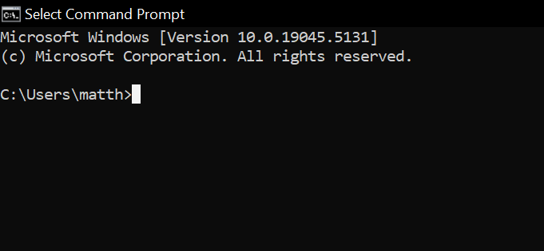<br><br>
**6. Ensure your command line / terminal is operational.**
<br><br>To ensure that your command line is in correct order to execute the unit tests. You want to use certain commands to check if Git and .NET 8 is correctly installed. In your command line, type `git --version` and check if Git is installed. Then, type `dotnet --list-sdks` and check if .NET 8 is correctly installed. Your results should look similar to this:<br>
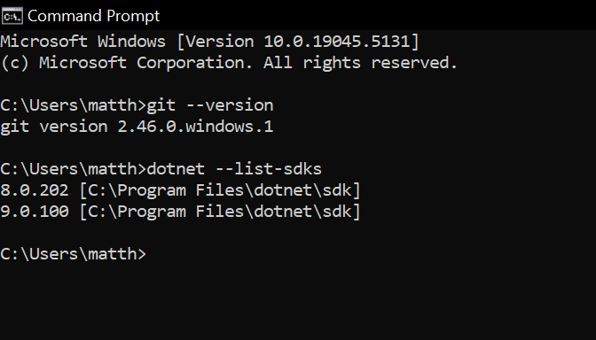
<br>If you see your command line / terminal, you are now ready to execute your project and unit tests from your machine. You can follow my directions on how I ran this project's code below!

## Executing Unit Tests
I will now walk you through executing the unit tests of this project through the command line. I understand that you may not have Rider IDE installed on your machine, so here is a way that you can execute the unit tests from your command line. This will be a step by-step-process with numbered instructions. <br><br>**Please note:** These command line instructions are tailored to those who have little to no experience in the command line / terminal.<br><br>
**Also Note:** You must correctly configure your environment to run these commands in the command line / terminal. Please visit the [Environment](#environment) section if you are having any difficulties!<br><br>
**Executing the Unit Tests from the Command Line:**
<br>This is the step-by-step process to cloning this repository to your machine and executing the unit tests from your command line. When given a command for you to input into your command line, feel free to copy and paste!
<br><br>**1.	Clone the repository to your machine.**<br><br>
To clone the repository to your machine, press the green "Code" button on the top right of the repository, and then copy the link to your clipboard.
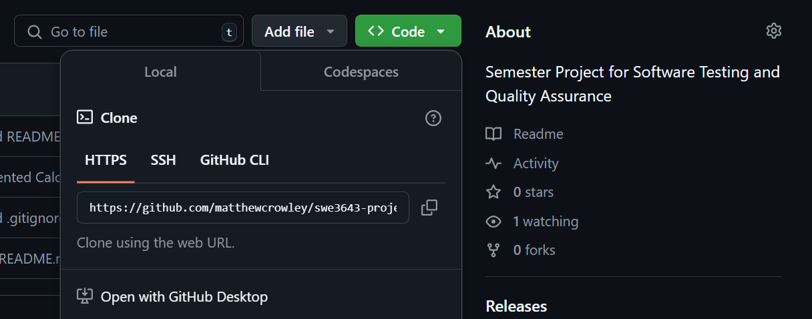 <br>
<br>**2.	Open your command line / terminal.**<br><br>
On Windows, open the "Start" menu and type `cmd` and click "Command Prompt". If you are on Mac, click the Launchpad icon in the Dock, type `Terminal` and click "Terminal".<br>
 <br>
<br>**3.	Direct to a chosen directory.**<br><br>
You want to choose where you want to place your cloned repository. To direct to any given directory, use the `cd` command, followed by the name of the directory. You can choose any directory for this, but I wanted to place the cloned repository in my Downloads folder, so my command was `cd Downloads`.<br>
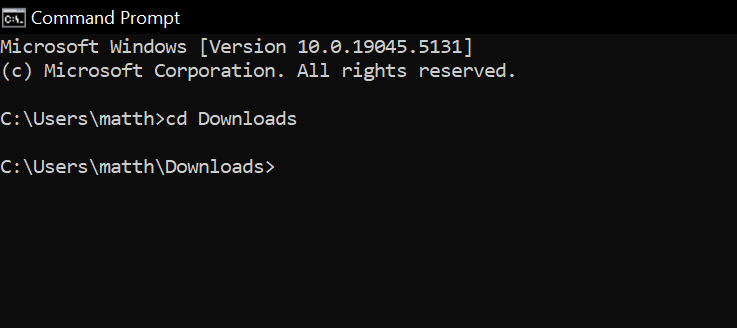 <br>
<br>**4.	Clone the repository.**<br><br>
Once you have directed to your chosen directory, use the `git clone` command followed by the URL of the repository. For example, my command for cloning this repository to my machine was `git clone https://github.com/matthewcrowley/swe3643-project.git`.
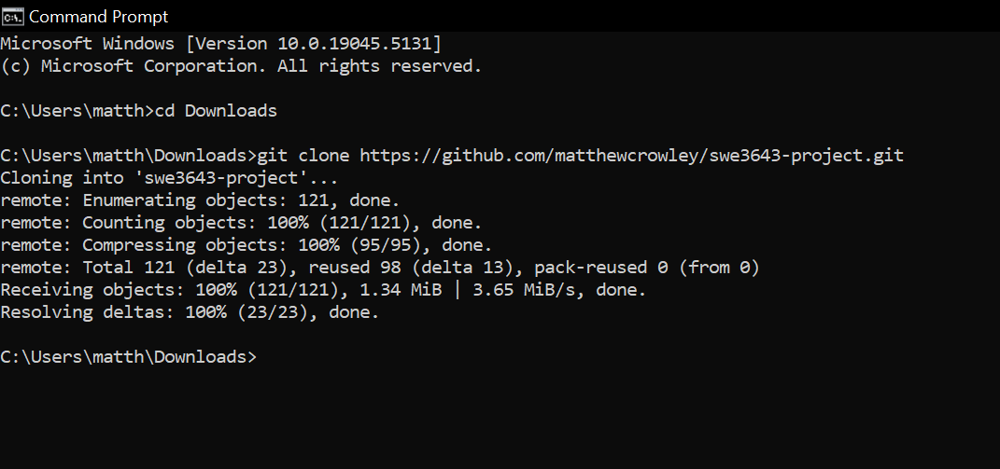 <br>
<br>**5.	Navigate to the unit tests in the newly cloned repository.**<br><br>
You want to navigate to the repository directory, into the source directory, then the Calculator directory, and then finally the CalculatorLogicUnitTests directory. To do this all at once, we are going to use one command, which is `cd swe3643-project/src/Calculator/CalculatorLogicUnitTests`.<br>
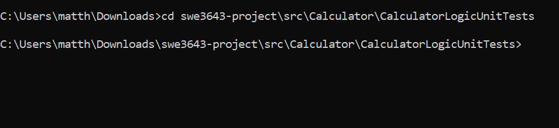 <br>
<br>**6.	Execute the Unit Tests.**<br><br>
Once in the unit tests directory, run the unit tests. The command for this is `dotnet test`.
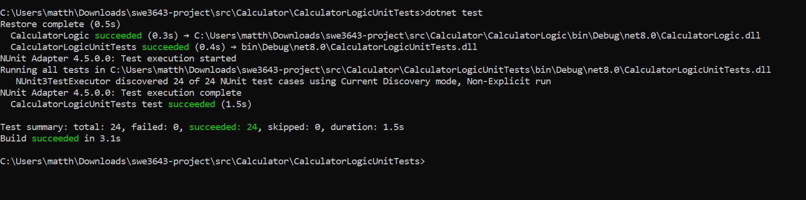
<br>You have now successfully executed the unit tests from the command line! <br><br>
This *should* be similar to the output that you see:
```
dotnet test
Restore complete (0.5s)
  CalculatorLogic succeeded (0.3s) → C:\Users\matth\Downloads\swe3643-project\src\Calculator\CalculatorLogic\bin\Debug\net8.0\CalculatorLogic.dll
  CalculatorLogicUnitTests succeeded (0.4s) → bin\Debug\net8.0\CalculatorLogicUnitTests.dll
NUnit Adapter 4.5.0.0: Test execution started
Running all tests in C:\Users\matth\Downloads\swe3643-project\src\Calculator\CalculatorLogicUnitTests\bin\Debug\net8.0\CalculatorLogicUnitTests.dll
   NUnit3TestExecutor discovered 24 of 24 NUnit test cases using Current Discovery mode, Non-Explicit run
NUnit Adapter 4.5.0.0: Test execution complete
  CalculatorLogicUnitTests test succeeded (1.5s)

Test summary: total: 24, failed: 0, succeeded: 24, skipped: 0, duration: 1.5s
Build succeeded in 3.1s
```

## Reviewing Unit Test Coverage
In this project, I wrote a total of **24** unit tests to test the statistical functions in my Calculator Logic module. Once the tests are run through either the command line or the Rider C# IDE, they all succeed and achieve 100% test coverage of all the statements and their paths. The first two screen captures display all of the unit tests succeeding, whilst the following two screen captures show the **100%** coverage in Test Coverage feature in Rider. <br>
<br>**Unit Test Successes**
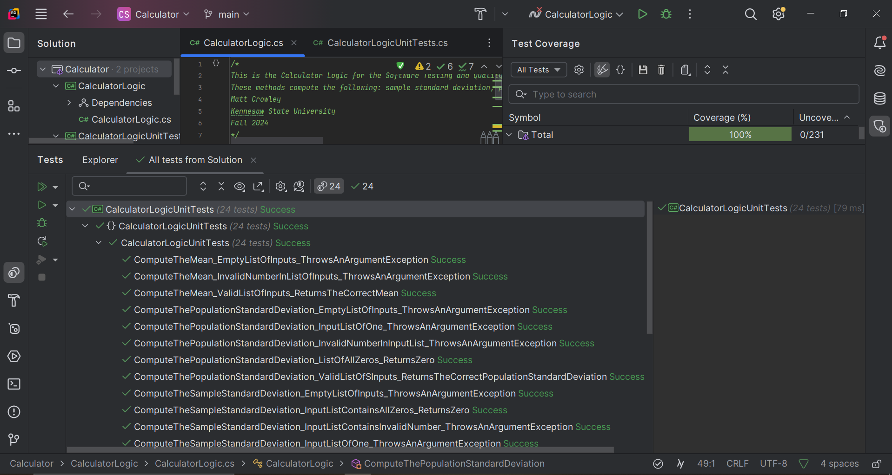
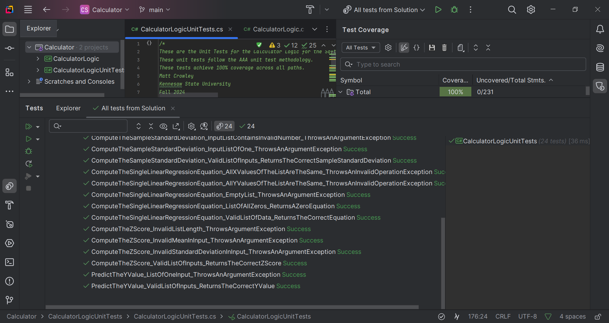

**100% Unit Test Coverage**
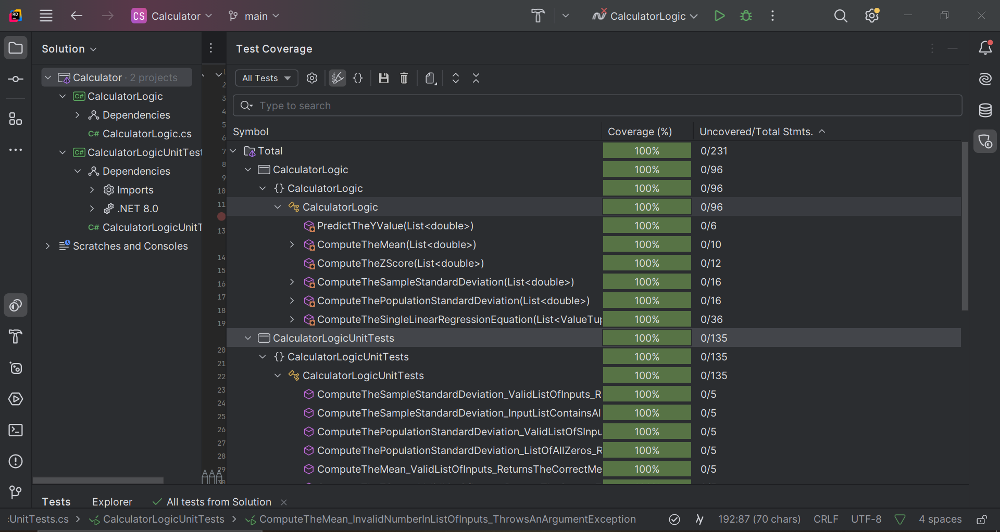
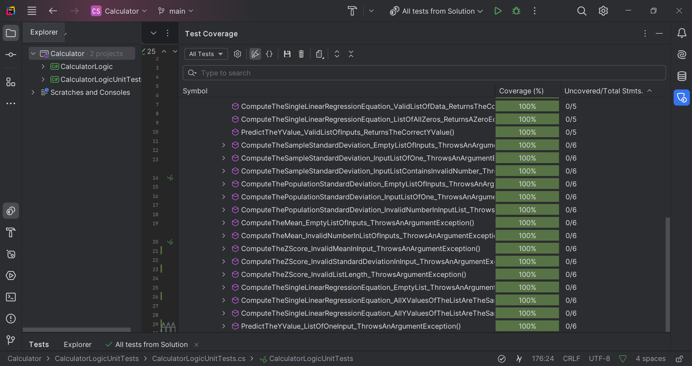

## Final Video Presentation
This final video presentation on YouTube is of me walking you through this repository along with executing my unit tests from the command line. Along with this, I also hop into my Rider IDE to show off my Calculator Logic and my Calculator Logic Unit Tests and their **100%** coverage! Check it out!
