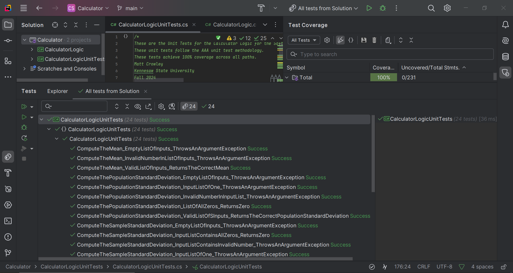

# KSU SWE 3643 Software Testing and Quality Assurance Semester Project: Web-Based Calculator Unit Tests

This repository contains the source code for the Calculator Logic and the CalculatorLogic Unit Tests. It also contains this README that lists the project team members, explains the system architecture with a professional diagram, explains the enviornment that this project was built in, along with step-by-step instructions on how to execute the project code on your own machine. On top of this, this README also reviews the 100% unit test coverage that my tests cover, and provides a quality YouTube video that further explains this repository and how to execute the unit tests on your machine.

**This project includes:** 

- A calculator module that performs these statistical functions:
	- The computation of the mean from a list of numeric values.
	- The computation of the sample and population standard deviations from a list of numeric values.
	- The computation of the Z-score from a value, mean, and standard deviation.
	- The computation of the single variable regression formula in the form of y = mx + b where you derive m (slope) and b (intercept) from a list of x,y numeric pairs.
	- The prediction of the Y-value from a regression formula where you supply the X value, the slope (m) and the intercept (b).
- A calculator unit tests module that achieves 100% coverage while testing:
	- Failing states.
	- Succeeding states.
	- Other various tests to achieve 100% coverage.
	- A total of 24 unit tests.
- A README.md file that explains and contains the following:
	- The person behind this project.
	- A professional diagram explaining the system architecture.
	- The environment required for this project.
	- Step-by-step instructions on how to execute these unit tests on your own machine.
	- Images demonstrating successfully ran unit tests along with their coverage of 100%.
	- A YouTube video fully explaining this repository and the steps needed to clone this project and run the tests.

## Table of Contents

- [Team Members](#team-members)
- [Architecture](#architecture)
- [Environment](#environment)
- [Executing Unit Tests](#executing-unit-tests)
- [Reviewing Unit Test Coverage](#reviewing-unit-test-coverage)
- [Final Video Presentation](#final-video-presentation)

## Team Members
This project was completed by one person:
- Matt Crowley 
	- Fun Fact: Loves animals! Would not hurt a fly!

## Architecture
The system is designed in a way where the two modules are loosely coupled. There are two different projects in this Rider solution. There is a CalculatorLogic project and a CalculatorLogicUnitTests project. The unit test class does not perform any mathematical operations whatsoever. It simply references the calculator logic module and performs tests on it. The tests achieve 100% coverage whilst testing for various different failing states and succeeding states. This diagram was created in PlantUML, and I will provide the diagram along with the code below.

**System Architecture Diagram**


**PlantUML Code**

```
@startuml
allowmixing

package "Calculator Logic Module" #lightblue
{
    class CalculatorLogic {
        + ComputeTheSampleStandardDeviation()
        + ComputeThePopulationStandardDeviation()
        + ComputeTheMean()
        + ComputeTheZScore()
        + ComputeTheSingleLinearRegressionEquation()
        + PredictTheYValue()
    }

}

package "Calculator Logic Unit Tests via NUnit (C#)" #lightyellow
{
  class CalculatorLogicUnitTests {
    + ComputeTheSampleStandardDeviation_ValidListOfInputs_ReturnsTheCorrectSampleStandardDeviation()
    + ComputeTheSampleStandardDeviation_EmptyListOfInputs_ThrowsAnArgumentException()
    + ComputeTheSampleStandardDeviation_InputListOfOne_ThrowsAnArgumentException()
    + ComputeTheSampleStandardDeviation_InputListContainsInvalidNumber_ThrowsAnArgumentException()
    + ComputeTheSampleStandardDeviation_InputListContainsAllZeros_ReturnsZero()
    + ComputeThePopulationStandardDeviation_ValidListOfSInputs_ReturnsTheCorrectPopulationStandardDeviation()
    + ComputeThePopulationStandardDeviation_EmptyListOfInputs_ThrowsAnArgumentException()
    + ComputeThePopulationStandardDeviation_InputListOfOne_ThrowsAnArgumentException()
    + ComputeThePopulationStandardDeviation_InvalidNumberInInputList_ThrowsAnArgumentException()
    + ComputeThePopulationStandardDeviation_ListOfAllZeros_ReturnsZero()
    + ComputeTheMean_ValidListOfInputs_ReturnsTheCorrectMean()
    + ComputeTheMean_EmptyListOfInputs_ThrowsAnArgumentException()
    + ComputeTheMean_InvalidNumberInListOfInputs_ThrowsAnArgumentException()
    + ComputeTheZScore_ValidListOfInputs_ReturnsTheCorrectZScore()
    + ComputeTheZScore_InvalidMeanInInput_ThrowsAnArgumentException()
    + ComputeTheZScore_InvalidStandardDeviationInInput_ThrowsAnArgumentException()
    + ComputeTheZScore_InvalidListLength_ThrowsArgumentException()
    + ComputeTheSingleLinearRegressionEquation_ValidListOfData_ReturnsTheCorrectEquation()
    + ComputeTheSingleLinearRegressionEquation_EmptyList_ThrowsAnArgumentException()
    + ComputeTheSingleLinearRegressionEquation_ListOfAllZeros_ReturnsAZeroEquation()
    + ComputeTheSingleLinearRegressionEquation_AllXValuesOfTheListAreTheSame_ThrowsAnInvalidOperationException()
    + ComputeTheSingleLinearRegressionEquation_AllYValuesOfTheListAreTheSame_ThrowsAnInvalidOperationException()
    + PredictTheYValue_ListOfOneInput_ThrowsAnArgumentException()
    + PredictTheYValue_ValidListOfInputs_ReturnsTheCorrectYValue()
  }
}

CalculatorLogicUnitTests -> CalculatorLogic : References

@enduml
```

## Environment

## Executing Unit Tests

## Reviewing Unit Test Coverage
In this project, I wrote a total of **24** unit tests to test the statistical functions in my Calculator Logic module. Once the tests are run through either the command line or the Rider C# IDE, they all succeed and achieve 100% test coverage of all the statements and their paths. The first two screen captures display all of the unit tests succeeding, whilst the following two screen captures show the 100% coverage in Test Coverage feature in Rider. <br>
**Unit Test Successes**



**100% Unit Test Coverage**


## Final Video Presentation
This final video presentation on YouTube is of me walking you through this repository along with executing my unit tests from the command line. Along with this, I also hop into my Rider IDE to show off my Calculator Logic and my Calculator Logic Unit Tests and their **100%** coverage! Check it out!
